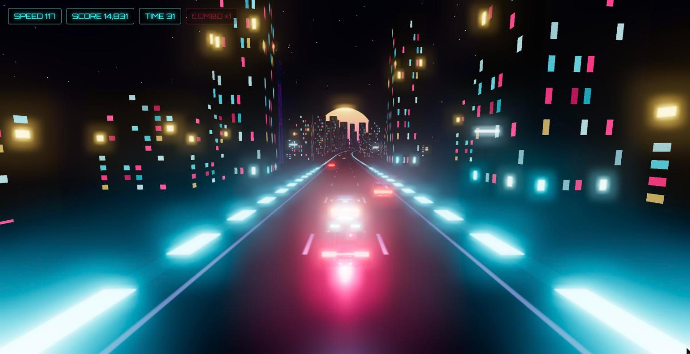

# Neon Night Racer

A real-time 3D synthwave arcade racer that runs directly in the browser. Three.js via import map — no build step, no bundler — with AI-generated 3D assets from [Meshy](https://www.meshy.ai).

**[▶ Play it in your browser](https://arshiamk.github.io/neon-night-racer/)**



## Features

- **Real-time 3D** — an endless, procedurally curving and undulating neon highway; instanced city skyline with glowing windows; AI-generated landmark buildings and sign gantries; wet-look asphalt; a single bloom pass that makes every emissive surface glow.
- **Endless arcade mode** — weave through traffic at 260 km/h. Near misses build a combo multiplier (up to ×10); collisions cost speed and reset it. Checkpoints add time, difficulty ramps with distance, and your best score persists.
- **Nine AI-generated models** — hero car, four traffic vehicles, three landmark buildings, and a highway gantry, generated with Meshy text-to-3D and compressed (Draco + WebP) from 82 MB raw to 3.5 MB total. The game is fully playable with primitive placeholders if the models are missing.
- **Procedural synthwave soundtrack** — a seamless Web Audio loop (pads, bass, kick, arps), an engine hum that tracks your speed, and whoosh/impact/checkpoint SFX. Drop a track at `assets/audio/music.mp3` to replace the generated loop.
- **Keyboard + touch** — WASD/arrows on desktop, on-screen controls on touch devices.

## Controls

| Input | Action |
| --- | --- |
| `↑` / `W` | Accelerate |
| `↓` / `S` | Brake |
| `←` / `→` or `A` / `D` | Steer |
| `Enter` (or tap) | Start / retry |
| `M` | Mute |

## How It Works

Everything lives in **road space**: a position is a distance `s` along the highway plus a signed lateral offset. The centerline is an analytic sum of sines for curvature and elevation, so any point and its exact tangent are computable for free — the road geometry, camera, car, traffic, and scenery all sample the same functions.

- The visible road is a small pool of ribbon chunks re-tessellated ahead of the player as they drive; memory use is constant no matter how far you go.
- Buildings and streetlights are instanced meshes repositioned per chunk, with deterministic per-slot randomness so the same stretch of city always looks the same.
- Collision and near-miss checks happen in road space (Δs, Δlat) — no 3D physics engine needed.
- Rendering is one `UnrealBloomPass` over a fogged night scene; the sun is a horizon-locked billboard.

## Run Locally

No build step. ES modules need a static server (opening `index.html` from disk won't work):

```
git clone https://github.com/Arshiamk/neon-night-racer.git
cd neon-night-racer
python -m http.server 8000
```

Then visit `http://localhost:8000`.

## Dev Tooling (optional)

```
npm install        # dev-only: playwright-core for the smoke test
npm test           # headless 30 s drive in system Chrome, asserts no errors
npm run assets     # regenerate models via Meshy (needs MESHY_API_KEY in .env)
```

The generator is resumable: finished models are skipped, in-flight Meshy tasks are re-polled rather than re-billed. Optimize new models with `@gltf-transform/cli` (Draco + 1K WebP) before committing.

## Project Structure

```
index.html        Page shell, import map, HUD, touch controls
style.css         Neon HUD, overlays, touch buttons
js/config.js      All gameplay/rendering tuning in one place
js/main.js        Game loop and state machine (title → running → game over)
js/world.js       Scene, chase camera, lighting, sky, bloom
js/track.js       Endless road chunks, scenery instancing, landmark pools
js/vehicle.js     Player car physics and model
js/traffic.js     Traffic spawning, movement, collision/near-miss events
js/score.js       Scoring, combos, checkpoint timer, difficulty, best score
js/hud.js         DOM overlay updates and toasts
js/audio.js       Procedural music, engine hum, SFX
js/input.js       Keyboard + touch input
js/assets.js      GLB loading, normalization, placeholder fallbacks
tools/            Meshy asset generation script
tests/            Headless smoke test
```

## Credits

Built by Arshia Mirshekar. 3D models generated with [Meshy](https://www.meshy.ai). Engine: [Three.js](https://threejs.org).

MIT — see [LICENSE](LICENSE).
