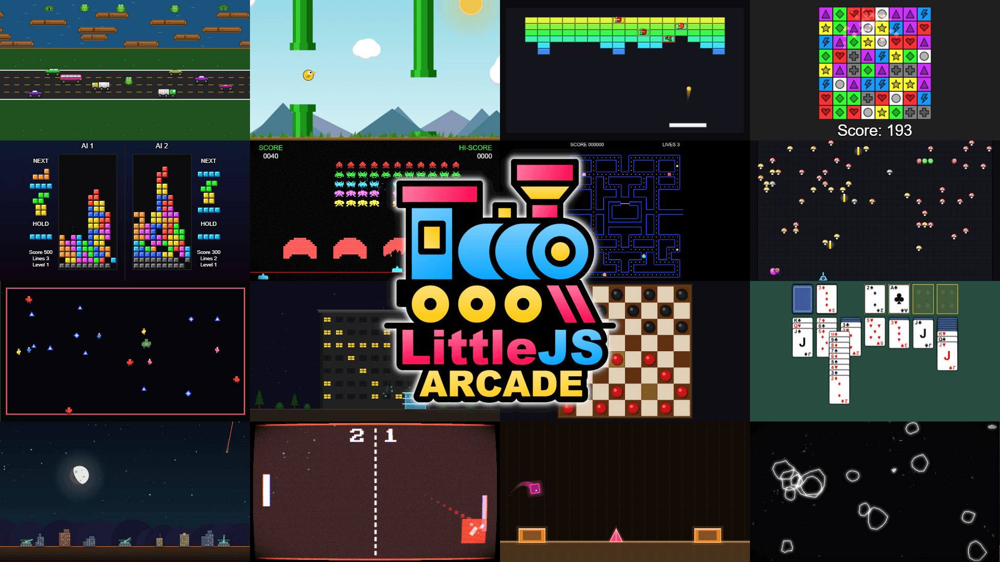

# 🕹️ LittleJS Arcade

*A collection of classic games built with LittleJS. Each one is a single, self-contained file and playable instantly in your browser.*

## 🎮 [▶ Play in LittleJS Arcade](https://killedbyapixel.github.io/LittleJSArcade)

The **LittleJS Arcade** is a growing collection of arcade games — shooters, puzzlers, board games, racers, physics toys, and more — all built with the [LittleJS](https://github.com/KilledByAPixel/LittleJS) engine. There's nothing to install: every game runs right in your browser, and because each one is open source, you can fork any of them as a starting point for your own.

### Inside the arcade
- ▶️ **Instant play** — pick a game and go, no installs or downloads
- 🔎 **Browse & search** by category, with Top Picks and Recently Played
- 🎬 **Live demos** — many games play themselves in attract mode right on the home screen
- 🎮 **Gamepad support**, fullscreen, and shareable links
- 💾 **Saved high scores** for each game
- 📱 Works on **desktop and mobile**
- 🧩 Every game is **open source** — fork it and make it your own

## 🕹️ Featured Games
A few favorites to start with — play the whole collection in the arcade...

- 🏙️ [Missile Defense](https://killedbyapixel.github.io/LittleJSArcade/games/missileDefense.html)
- 🤖 [Robo Rescue](https://killedbyapixel.github.io/LittleJSArcade/games/roboRescue.html)
- 🎱 [Pool](https://killedbyapixel.github.io/LittleJSArcade/games/pool.html)
- 🧛 [Emoji Survivors](https://killedbyapixel.github.io/LittleJSArcade/games/emojiSurvivors.html)
- 👾 [Space Intruders](https://killedbyapixel.github.io/LittleJSArcade/games/spaceIntruders.html)
- 🐸 [Froggit](https://killedbyapixel.github.io/LittleJSArcade/games/froggit.html)
- 🃏 [FreeCell](https://killedbyapixel.github.io/LittleJSArcade/games/freecell.html)
- 🔴 [Checkers](https://killedbyapixel.github.io/LittleJSArcade/games/checkers.html)

## 📚 Resources
- [LittleJS Engine](https://github.com/KilledByAPixel/LittleJS) — the main LittleJS repository
- [LittleJS AI Tools](https://github.com/KilledByAPixel/LittleJS-AI) — templates and skills to improve LittleJS + AI workflows
- [LittleJS GPT](https://chatgpt.com/g/g-67c7c080b5bc81919736bc8815836be6-littlejs-game-maker) — make games in ChatGPT without writing any code
- [Games Folder](games/) — the source for every game in the arcade
- [Templates Folder](templates/) — starting templates and reusable components

## 📄 License

LittleJS and everything in this repository (except Twemoji font) is **MIT licensed** — see [LICENSE](LICENSE) for details.

Twemoji (twemoji.ttf) (c) Twitter, Inc & contributors, [licensed under CC-BY 4.0](https://creativecommons.org/licenses/by/4.0/)
